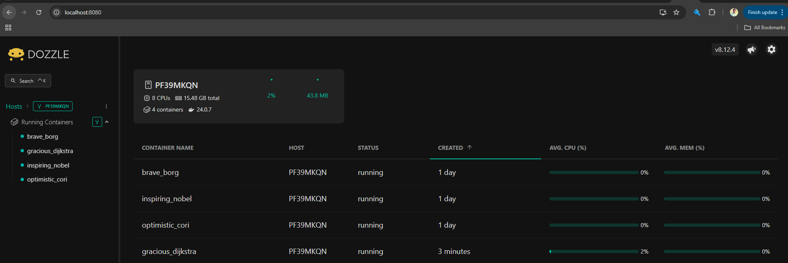

# Dozzle

Dozzle is a simple, lightweight application that provides you with a web based interface to monitor your Docker container logs live. It doesn’t store log information, it is for live monitoring of your container logs only.
By providing real-time log streaming, filtering, and searching capabilities, Dozzle makes debugging and troubleshooting in a Docker environment significantly more efficient.

## To Deploy Dozzle
```bash
docker run -d -v /var/run/docker.sock:/var/run/docker.sock -p 8080:8080 amir20/dozzle:latest
```



## Using docker-compose
```bash
version: "3"
services:
  dozzle:
    container_name: dozzle
    image: amir20/dozzle:latest
    volumes:
      - /var/run/docker.sock:/var/run/docker.sock
    ports:
      - 9999:8080
```

## Filtering capability
The ability to filter and search through logs allows users to pinpoint specific entries, which is essential for debugging complex applications.

