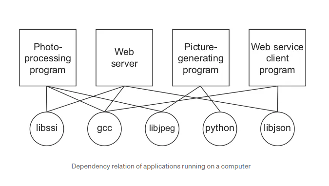
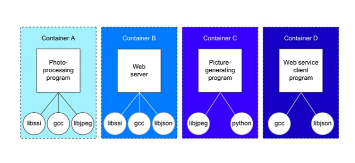
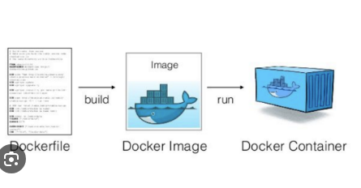
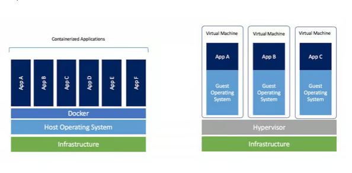

# Docker

## Topics

- Need of containerization 
- what is docker.
-  VM vs Containers
-  Container lifecycle policy.
- Installation of docker.
- Docker Images
- Create a hello world container.
- Create multiple containers from same  Image.
- Docker container CLI commands.
- Docker Volumes
- Docker networking
- How to Create a Docker file.
- Building custom docker Image.
- Pushing to docker image to repository.
- Trivy and Dockle for container scanning

## Need of containerization 
Before installing any software we have to find out what operating system does it run on, what resources does it need, what other software does it depend upon, 
is there any other software already installed that might interfere with the installation, and finally, how to install it .

```bash
The more software we use, the more difficult is becomes to manage and run them.
```



After installation comes the process of upgrading and maintaining the software. ```Computers have more that one application running. What if one application needs upgrade in the dependency but other application runs on older version of the dependency?``` 
Finally, when we want to remove a software we need to remember all the changes we had to do to install the software and then undo them after installation

This can solved using containers, Here is the containized version of above problem.




## what is the difference between container and a VM.


## What is Docker
Docker is an open-source platform that enables developers to automate the deployment of applications inside lightweight, portable containers. ```These containers bundle the application together with all its dependencies, libraries, and configuration files, ensuring consistency across different environments, such as development, testing, and production```

Docker is a tool that simplifies the process of ```installing, running, distributing and deleting``` software

## Key components of Docker include:
```Docker Engine```: The core of Docker, responsible for creating and managing containers. It consists of a daemon (dockerd) and a REST API that allows users to interact with Docker.

```DockerFile```:  The text file that contains instructions for building Docker images.

```DockerImage```:  A lightweight, standalone, and executable package that contains everything needed to run a piece of software, including the code, runtime, libraries, environment variables, and configuration files. Images are built from Dockerfiles and can be stored in Docker registries.

```Docker Container```:  A runtime instance of a Docker image. Containers run isolated from one another and from the host system, but share the kernel of the host operating system. They can be started, stopped, moved, and deleted, providing a consistent environment for running applications

```Docker Registry```: A repository for storing and sharing Docker images. Docker Hub is the default public registry, hosting millions of Docker images, but organizations can set up private registries to store proprietary or sensitive images.


## Docker Image and container 



## Installing of a Docker
```bash
sudo yum install docker
systemctl enable docker
systemctl start docker
```

## States of a container.
- ```Creation```: The container is created using a Docker image. This involves pulling the necessary image layers from a registry (such as Docker Hub) if they're not already available locally, and then instantiating the container based on the image's specifications.

- ```Running```: Once created, the container enters the running state. It executes the command specified in the Dockerfile.

- ```Paused```: Containers can be paused, which suspends all processes running within the container.
Pausing a container can be useful for troubleshooting or for temporarily halting operations without stopping the container entirely.

- ```Restarting```: Restarting a container involves stopping it and then starting it again.
- ```stopping```: : The container is stopped either manually by the user or automatically as a result of a specific event or condition.
- ```Deletion```: Finally, the container is deleted, removing it from the Docker host system. This frees up resources such as disk space and memory. Containers can be deleted manually by the user,


## Docker vs VM



## Docker CLI commands.

### To search the docker image from docker hub

```bash
docker search <image-name>
docker search nginx
```
### To pull/Download the docker image from docker hub
```bash
syntax :: docker pull [OPTIONS] IMAGE[:TAG|@DIGEST]
docker pull ubuntu:20.04
```Note:: ubuntu is the image and 20:04 is the tag```
docker pull nginx
Using default tag: latest
latest: Pulling from library/nginx
8a1e25ce7c4f: Pull complete
e78b137be355: Pull complete
39fc875bd2b2: Pull complete
035788421403: Pull complete
87c3fb37cbf2: Pull complete
c5cdd1ce752d: Pull complete
33952c599532: Pull complete
Digest: sha256:6db391d1c0cfb30588ba0bf72ea999404f2764febf0f1f196acd5867ac7efa7e
Status: Downloaded newer image for nginx:latest
docker.io/library/nginx:latest
```
### To view the docker images.
```bash
 docker images
REPOSITORY    TAG       IMAGE ID       CREATED         SIZE
nginx         latest    92b11f67642b   4 weeks ago     187MB
hello-world   latest    d2c94e258dcb   10 months ago   13.3kB
root@ubuntuserver:~#
```
### To Create the docker container
```bash
syntax: docker run [OPTIONS] IMAGE [COMMAND] [ARG...]

Method 1:
Daemonized mode(-d)
docker run -d --name docker-nginx1 -p 80:80 nginx
docker run -d --name my-nginx-container -p 8080:80 nginx
8080 is the host port
80 is the container port
```
### To view the docker container status
```bash
docker ps
docker ps -a
```

### To start/stop/restat container.
```bash
di


#Setting CPU share 
The amount of CPU share a container takes up can be controlled using the -c option
in the docker run command:

docker run -c 10 -it ubuntu /bin/bash

##Setting up the cpu share of the running containers

Yes. Edit the
file at /sys/fs/cgroup/cpu/docker/<container-id>/cpu.shares and enter the
priority you want to give it


#Setting up the memory limit
docker run -m <value><optional unit>
docker run -m 1024m -dit ubuntu /bin/bash


##How to link containers

We can link both container using --link option,Please find the below procedure

1. Create a nginx container from nginx image
root@puppetmaster:~# docker run -d --name nginx1 nginx
0d80cfabe91df100f4a949edb7051a5d008eddd76d9c9433a00e7cc3c036ce01

2.Create a another container with which you would like to attach with first container
root@puppetmaster:~# docker run -it --link  nginx1:nginx --name ngclinet1 nginx bash
root@2124ecc17fde:/#


Syntax
sourcecontainername::newcontaineralias
newcontaineralias: can be any string

ngclient1 : check the last line,where 172.17.0.6 is the IP address if nginx1 container
root@2124ecc17fde:/# cat /etc/hosts
172.17.0.8      2124ecc17fde
127.0.0.1       localhost
::1     localhost ip6-localhost ip6-loopback
fe00::0 ip6-localnet
ff00::0 ip6-mcastprefix
ff02::1 ip6-allnodes
ff02::2 ip6-allrouters
172.17.0.6      nginx 0d80cfabe91d nginx1


3.Creating another container 
root@puppetmaster:~# docker run -it --link nginx1:nginx --name ngclient3 nginx bash
root@4617a5359b80:/# cat /etc/hosts
172.17.0.10     4617a5359b80
127.0.0.1       localhost
::1     localhost ip6-localhost ip6-loopback
fe00::0 ip6-localnet
ff00::0 ip6-mcastprefix
ff02::1 ip6-allnodes
ff02::2 ip6-allrouters
172.17.0.6      nginx 0d80cfabe91d nginx1
root@4617a5359b80:/#


Here is example of docker-compose which does the same
version: '2'
services:
  webapps:
    build: .
    links:
      - "rabbitmq:rabmq"
      - "redis"

  rabbitmq:
    image: rabbitmq

  redis:
    image: redis


Reference docker notes
https://rominirani.com/docker-tutorial-series-a7e6ff90a023


#docker search results
docker search --limit 5 alpine 
Notes:
Docker searches for images on the Docker public registry, which has a repository for images at https://index.docker.io/v1/.

#docker restart policy
docker container run --restart=always -d -i -t ubuntu /bin/bash

There are 3 restar policy 
no : This does not start container if it dies
on-failure : This restarts  the container  if it fails with non-zero exit code
always: This will always restart the container without worrying about the exit code


3.Difference between CMD and ENTRYPOINT

when we use CMD  like below in the dockerfile
FROM ubunut:latest
CMD echo "welcome to docker"

when you run the container without any args  whatever message in the dockerfile wrt cmd ,it will be printed as it.
At the same time when you mention args with docker run command, argument will overwite with CMD metioned in the docker file

Using ENTRYPOINT
Same scenario , when you use argument with docker run command  new argument with append to existing entrypoint.


BEST way to USE CMD and ENTRYPOINT

In the docker file
FROM ubuntu:latest
ENTRYPOINT ["echo"]
CMD ["Hi docker"]

when you do docker run, if argument is not mentioned it will print Hi docker,But if the argument is mentioned ,
argument will override the CMD.


4. How to make container smaller 
Images when building from docker file one point to consider is it should be small as possible.

Example most of the docker files are written in the below format
FROM ubuntu  
RUN apt-get update && apt-get install vim

Few people write the docker file using below method
FROM ubuntu  
RUN apt-get update 
RUN apt-get install vim

Snce Docker 1.10 the COPY, ADD and RUN statements add a new layer to your image. The last  example created two layers instead of just one.

Note: Layers use space and the more layer you have, the heavier the final image is. 

Example of writing a docker file

FROM node:8
EXPOSE 3000
WORKDIR /app COPY package.json index.js ./ 
RUN npm install CMD [“npm”, “start”]

--contents of index.js

const express = require('express') 
const app = express()  
app.get('/', (req, res) => res.send('Hello World!'))  app.listen(3000, () => {   
console.log(`Example app listening on port 3000!`) 
})

--contens to package.json

{ “name”: “hello-world”, 
“version”: “1.0.0”, 
“main”: “index.js”, 
“dependencies”: { “express”: “⁴.16.2” },
 “scripts”: { “start”: “node index.js” } 
}

Build the image 
docker build -t node-vanilla .

There is almost 10MB differce when you exeucte both.


second method is using distroless.

Example

FROM node:8 as build
WORKDIR /app
COPY package.json index.js ./
RUN npm install
FROM gcr.io/distroless/nodejs
COPY --from=build /app /
EXPOSE 3000
CMD ["index.js"]

This method is bit secure and lightweight and there is no shell to the container.
It’s bad news because you can only execute the binaries in the container. The only binary you could run is Node.js:

It’s good news because an attacker exploiting your application and gaining access to the container won’t be able to do as much damage as if were to access a shell.


Third method
Smaller base images with Alpine

FROM node:8 as build
WORKDIR /app
COPY package.json index.js ./
RUN npm install
FROM node:8-alpine
COPY --from=build /app /
EXPOSE 3000
CMD ["npm", "start"]

Reference link:

https://medium.com/engineitops/3-tips-and-tricks-for-smaller-docker-images-570e85c01990


#Docker networking commands

docker network help
docker network inspect bridge 
docker network create mynetwork----create a network
docker network create -d bridge mynetwork2--- d specifies the the network type
docker network rm mynetwork-- Remove the network 
docker container run -it --net=mynetwork nginx---connect to a network
docker container run -it --net=host nginx---for host only network


